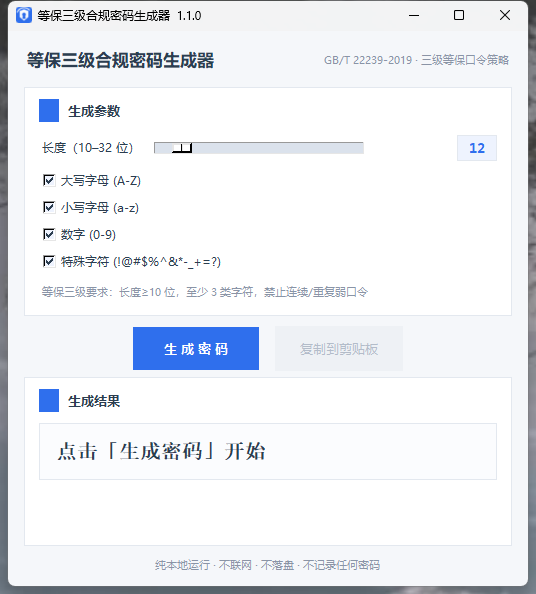

# 等保三级合规密码生成器 (PasswordGenerator)



依据 **GB/T 22239-2019《信息安全技术 网络安全等级保护基本要求》** 三级等保口令策略要求编写的图形界面密码生成工具（Python + Tkinter，PyInstaller 打包为 Windows 单文件 .exe）。

## 生成规则

| 项目 | 要求 |
|------|------|
| 长度 | 不低于 10 位（滑块 10–32 可调，默认 12） |
| 字符类型 | 大写字母、小写字母、数字、特殊字符（`!@#$%^&*-_+=?`）四类可勾选，每类至少 1 个，等保要求至少 3 类 |
| 随机源 | Python `secrets` 模块（密码学安全随机源，非 `random`），Fisher-Yates 安全洗牌 |
| 弱口令拦截 | 连续递增/递减序列（abc/123/xyz）、同字符重复 ≥3 次、常见弱口令词根（123456、qwerty 等 50+ 条） |
| 隐私 | 纯本地运行，不联网、不落盘、不记录任何生成的密码 |

## 架构

```
password_core.py    核心逻辑：生成 / 合规检测 / 熵估算（纯标准库，可独立单测，无 GUI 依赖）
ui.py               图形界面：卡片式浅色主题、图标、复制反馈、实时合规状态
password_generator.py  程序入口（薄壳，仅 main() 调用）
app.ico             应用图标（make_icon.py 生成，PIL 绘图）
build.bat           PyInstaller 打包脚本
```

## 使用

下载 [Releases](../../releases) 中的 `PasswordGenerator.exe`，双击运行即可（Windows 7+，无需安装 Python）。

> 首次运行 Windows 可能弹出 SmartScreen「未知发布者」提示，点击「仍要运行」即可。

## 界面功能

- 长度滑块 + 四类字符复选框 + 一键生成（回车键也可触发）
- 一键复制到剪贴板（复制后按钮显示「✓ 已复制」反馈）
- 生成后实时合规判定：
  - 绿色 = 满足等保三级口令策略
  - 黄色 = 达标但字符类型不足 3 类（提醒）
  - 红色 = 具体风险项列表
- 底部实时显示口令熵（bit）、字符池大小、已选类型数

## 从源码运行

```bash
# 需要 Python 3.9+
python password_generator.py
```

## 打包

```bat
:: Windows，需已安装 PyInstaller
pip install pyinstaller
build.bat
:: 输出: dist\PasswordGenerator.exe
```

## 验证

- 300 次生成 10 位全类型密码，300/300 通过合规自检
- 12 位口令熵约 75 bit（高于通常要求的 60+ bit）
- 弱口令样例 `abcd1234XY!`、`111222AAAA!`、`qwerty12345` 均被正确拦截
- UI 冒烟测试：生成 / 复制 / 单类勾选 / 空选拦截 / 32 位边界 全部通过

## 免责声明

本工具仅用于帮助生成符合等级保护要求的口令，请结合本单位安全管理制度（如口令有效期、更换频率、存储要求）使用。

## License

MIT
